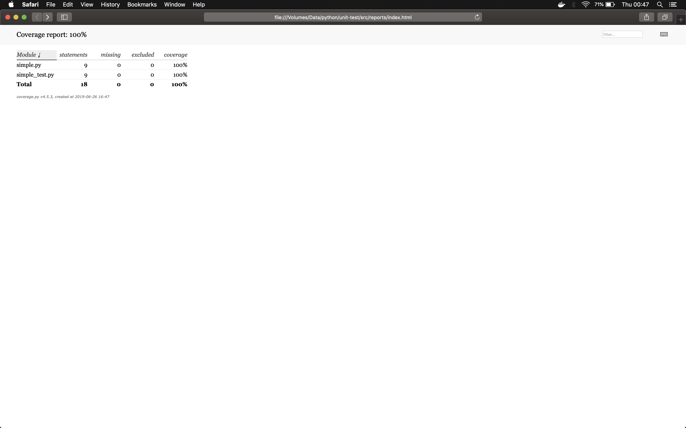
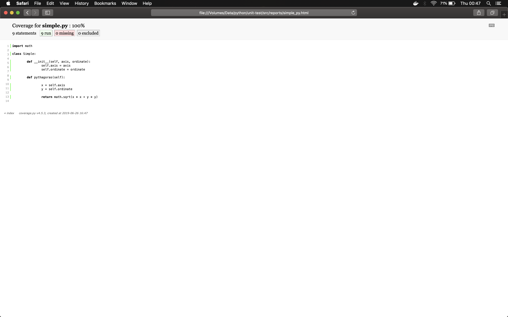
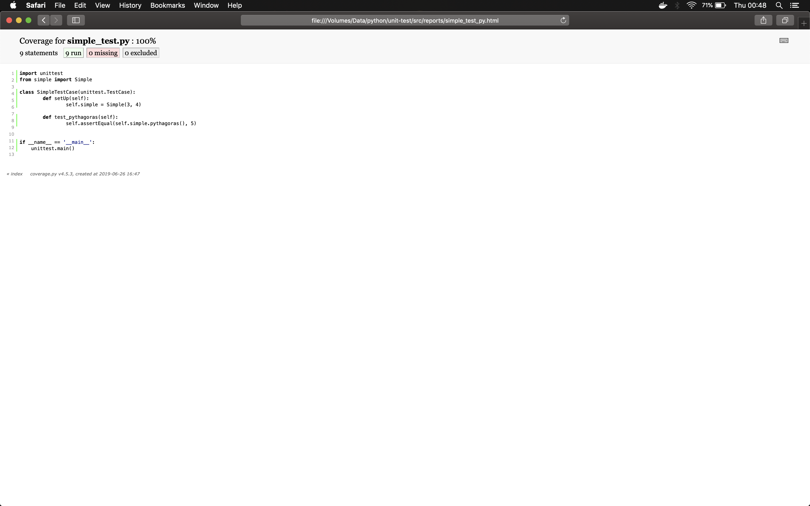

# docker-python-coverage

### How to run

1. `docker build -t docker-python-coverage .`
2. `docker run -it --rm --name docker-python-coverage -v "$PWD":/opt/app docker-python-coverage`
3. `coverage run simple_test.py`
3. `coverage html -d reports`
4. Screenshot :

